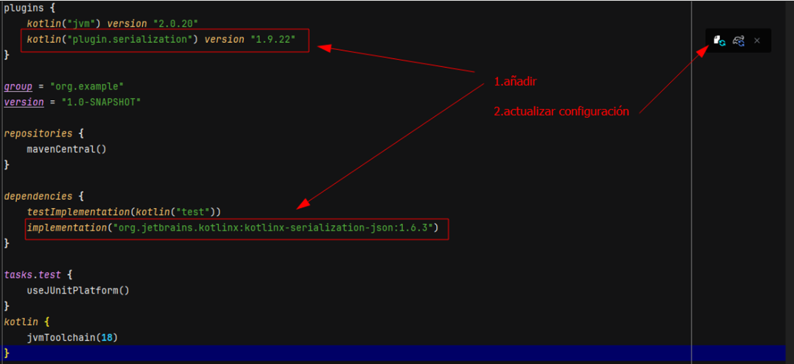

# consultasAPIRest
Este proyecto contiene código que:
- utiliza un cliente http sencillo, concretamente httpClient de java. Viene incluido en JDK desde versión 11 y por tanto se puede usar desde Kotlin si kotlin esta usando un JDK 11 o superior. El cliente se usa para obtener datos Json de un api rest pública
- los datos obtenidos se deserializan a objetos que pertenecen a dataclass que reflejan la estructuran del json. concretamente obtenemos una lista de usuarios. Para poder hacer esto tendremos que configurar build.gradle.kts
- sobre lista podemos hacer consultas, en este caso simplemente se barrre la lista y se imprimen campos de usuarios

## Configuración del proyecto
- crea un proyecto con build Gradle
- configura build.gradle.kts para poder deserializar(convertir) el String Json a clases Kotlin
    -  en plugins:  *kotlin("plugin.serialization") version "1.9.22"*
    -  en dependencias:  *implementation("org.jetbrains.kotlinx:kotlinx-serialization-json:1.6.3")*

no olvides recargar la configuración del kts. Mientras visualicemos el icono de load es que quedan cargas pendientes

## Generar las clases Kotlin receptoras de la deserialización.
Se pueden escribir a mano cuando el Json es sencillo, o bien,  usar herramientas automáticas utilizando uno de los  plugins de IntelliJ para tal fin,  usando una IA, etc. 
## SE PIDE
Que de forma análoga al código ejemplo:
- eligas una api rest. Puedes utilizar la del ejemplo pero estaría bien que investigues y uses otra si tienes tiempo. 
- obtengas datos json desde kotlin
- los deserialices desde kotlin
- y ejecutes sobre ellos tres o cuatro consultas interesantes. Procura que no sean tan simples como la del ejemplo y que usen ordenar, agrupar, mapear, etc.

